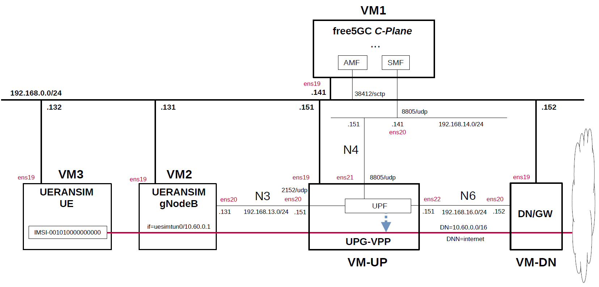

# free5GC 5GC & UERANSIM UE / RAN Sample Configuration - VPP-UPF with DPDK
This describes a simple configuration for working free5GC and VPP-UPF with DPDK.
In particular, see [here](https://github.com/s5uishida/install_vpp_upf_dpdk) for VPP-UPF with DPDK configuration.

---

<h2 id="conf_list">List of Sample Configurations</h2>

1. [One SMF, Multiple UPFs and DNNs](https://github.com/s5uishida/free5gc_ueransim_sample_config)
2. [Select nearby UPF according to the connected gNodeB](https://github.com/s5uishida/free5gc_ueransim_nearby_upf_sample_config)
3. [Select UPF based on S-NSSAI](https://github.com/s5uishida/free5gc_ueransim_snssai_upf_sample_config)
4. [ULCL(Uplink Classifier)](https://github.com/s5uishida/free5gc_ueransim_ulcl_sample_config)
5. [ULCL with one I-UPF and two PSA-UPFs](https://github.com/s5uishida/free5gc_ueransim_ulcl_2_sample_config)
6. VPP-UPF with DPDK (this article)

---

<h2 id="misc">Miscellaneous Notes</h2>

- [Install MongoDB 6.0 and free5GC WebUI](https://github.com/s5uishida/free5gc_install_mongodb6_webui)
- [Install MongoDB 4.4.18 on Ubuntu 20.04 for Raspberry Pi 4B](https://github.com/s5uishida/install_mongodb_on_ubuntu_for_rp4b)
- [A Note for 5G SUCI Profile A/B Scheme](https://github.com/s5uishida/note_5g_suci_profile_ab)
- [A Note for Enabling NetworkInstance IE Encoding for free5GC v3.3.0](https://github.com/s5uishida/enable_network_instance_encoding_free5gc_v3_3_0)
- [Install VPP-UPF with DPDK on Host](https://github.com/s5uishida/install_vpp_upf_dpdk)

---

<h2 id="toc">Table of Contents</h2>

- [Overview of free5GC 5GC Simulation Mobile Network](#overview)
- [Changes in configuration files of free5GC 5GC, VPP-UPF and UERANSIM UE / RAN](#changes)
  - [Changes in configuration files of free5GC 5GC C-Plane](#changes_cp)
  - [Changes in configuration files of VPP-UPF](#changes_up)
  - [Changes in configuration files of UERANSIM UE / RAN](#changes_ueransim)
    - [Changes in configuration files of RAN](#changes_ran)
    - [Changes in configuration files of UE (IMSI-001010000000000)](#changes_ue)
- [Network settings of free5GC 5GC, VPP-UPF and UERANSIM UE / RAN](#network_settings)
  - [Network settings of VPP-UPF and Data Network Gateway](#network_settings_up)
- [Build free5GC, VPP-UPF and UERANSIM](#build)
- [Run free5GC 5GC, VPP-UPF and UERANSIM UE / RAN](#run)
  - [Run VPP-UPF](#run_up)
  - [Run free5GC 5GC C-Plane](#run_cp)
  - [Run UERANSIM](#run_ueran)
    - [Start gNB](#start_gnb)
    - [Start UE](#start_ue)
- [Ping google.com](#ping)
  - [Case for going through DN 10.60.0.0/16](#ping_1)
- [Changelog (summary)](#changelog)

---

<h2 id="overview">Overview of free5GC 5GC Simulation Mobile Network</h2>

This describes a simple configuration of C-Plane, VPP-UPF and Data Network Gateway for free5GC.
**Note that this configuration is implemented with Virtualbox VMs.**

The following minimum configuration was set as a condition.
- One UPF and Data Network Gateway
- One UE and one DNN

The built simulation environment is as follows.

</img>

The 5GC / VPP-UPF / UE / RAN used are as follows.
- 5GC - free5GC v3.3.0 (2023.07.15) - https://github.com/free5gc/free5gc
- VPP-UPF - OpenAir CN 5G for UPF v1.5.1 (2023.06.14) - https://gitlab.eurecom.fr/oai/cn5g/oai-cn5g-upf-vpp
- UE / RAN - UERANSIM v3.2.6 (2023.06.14) - https://github.com/aligungr/UERANSIM

Each VMs are as follows.  
| VM | SW & Role | IP address | OS | CPU<br>(Min) | Memory<br>(Min) | HDD<br>(Min) |
| --- | --- | --- | --- | --- | --- | --- |
| VM1 | free5GC 5GC C-Plane | 192.168.0.141/24 | Ubuntu 22.04 | 1 | 2GB | 20GB |
| VM-UP | OpenAir CN 5G for UPF | 192.168.0.151/24 | Ubuntu 22.04 | 2 | 8GB | 20GB |
| VM-DN | Data Network Gateway  | 192.168.0.152/24 | Ubuntu 22.04 | 1 | 1GB | 10GB |
| VM2 | UERANSIM RAN (gNodeB) | 192.168.0.131/24 | Ubuntu 22.04 | 1 | 1GB | 10GB |
| VM3 | UERANSIM UE | 192.168.0.132/24 | Ubuntu 22.04 | 1 | 1GB | 10GB |

The network interfaces of each VM are as follows.
**Note. Do not enable(up) any devices that will be under the control of DPDK.
These devices will be enabled and set IP addresses in the `init.conf` file of VPP-UPF.**
| VM | Device | Network Adapter | IP address | Interface | Under DPDK |
| --- | --- | --- | --- | --- | --- |
| VM1 | enp0s3 | NAT(default) | 10.0.2.15/24 | (VM default NW) | -- |
| | enp0s8 | Bridged Adapter | 192.168.0.141/24 | (Mgmt NW) | -- |
| | enp0s9 | NAT Network | 192.168.14.141/24 | N4 | -- |
| VM-UP | enp0s3 | NAT(default) | 10.0.2.15/24 | (VM default NW) | -- |
| | enp0s8 | Bridged Adapter | 192.168.0.151/24 | (Mgmt NW) | -- |
| | enp0s9 | NAT Network | 192.168.13.151/24 | N3 | x |
| | enp0s10 | NAT Network | 192.168.14.151/24 | N4 | x |
| | enp0s16 | NAT Network | 192.168.16.151/24 | N6 | x |
| VM-DN | enp0s3 | NAT(default) | 10.0.2.15/24 | (VM default NW) | -- |
| | enp0s8 | Bridged Adapter | 192.168.0.152/24 | (Mgmt NW) | -- |
| | enp0s9 | NAT Network | 192.168.16.152/24 | N6 | -- |
| VM2 | enp0s3 | NAT(default) | 10.0.2.15/24 | (VM default NW) | -- |
| | enp0s8 | Bridged Adapter | 192.168.0.131/24 | (Mgmt NW) | -- |
| | enp0s9 | NAT Network | 192.168.13.131/24 | N3 | -- |
| VM3 | enp0s3 | NAT(default) | 10.0.2.15/24 | (VM default NW) | -- |
| | enp0s8 | Bridged Adapter | 192.168.0.132/24 | (Mgmt NW) | -- |

NAT networks of Virtualbox  are as follows.
| Network Name | Network CIDR |
| --- | --- |
| N3 | 192.168.13.0/24 |
| N4 | 192.168.14.0/24 |
| N6 | 192.168.16.0/24 |

Set network instance to `internet`.
| Network Instance |
| --- |
| internet |

Subscriber Information (other information is the same) is as follows.  
**Note. Please select OP or OPc according to the setting of UERANSIM UE configuration file.**
| UE | IMSI | DNN | OP/OPc |
| --- | --- | --- | --- |
| UE | 001010000000000 | internet | OPc |

I registered these information with the free5GC WebUI.
In addition, [3GPP TS 35.208](https://www.3gpp.org/DynaReport/35208.htm) "4.3 Test Sets" is published by 3GPP as test data for the 3GPP authentication and key generation functions (MILENAGE).

The DN is as follows.
| DN | DNN | TUNnel interface of UE |
| --- | --- | --- |
| 10.60.0.0/16 | internet | uesimtun0 |

<h2 id="changes">Changes in configuration files of free5GC 5GC, VPP-UPF and UERANSIM UE / RAN</h2>

Please refer to the following for building free5GC, VPP-UPF and UERANSIM respectively.
- free5GC v3.3.0 (2023.07.15) - https://github.com/free5gc/free5gc/wiki/Installation
- OpenAir CN 5G for UPF v1.5.1 (2023.06.14) - https://github.com/s5uishida/install_vpp_upf_dpdk
- UERANSIM v3.2.6 (2023.06.14) - https://github.com/aligungr/UERANSIM/wiki/Installation

<h3 id="changes_cp">Changes in configuration files of free5GC 5GC C-Plane</h3>

The combination of DNN and S-NSSAI parameters can be used in the logic that selects UPF as the connection destination by PFCP.

- DNN
- S-NSSAI

For the sake of simplicity, This time, only DNN will be changed. S-NSSAI of all UEs is fixed as `SST=1` and `SD=010203`.

- `free5gc/config/amfcfg.yaml`
```diff
--- amfcfg.yaml.orig    2023-06-27 19:09:10.707252803 +0900
+++ amfcfg.yaml 2023-06-27 19:13:07.031736927 +0900
@@ -5,7 +5,7 @@
 configuration:
   amfName: AMF # the name of this AMF
   ngapIpList:  # the IP list of N2 interfaces on this AMF
-    - 127.0.0.18
+    - 192.168.0.141
   ngapPort: 38412 # the SCTP port listened by NGAP
   sbi: # Service-based interface information
     scheme: http # the protocol for sbi (http or https)
@@ -24,18 +24,18 @@
   servedGuamiList: # Guami (Globally Unique AMF ID) list supported by this AMF
     # <GUAMI> = <MCC><MNC><AMF ID>
     - plmnId: # Public Land Mobile Network ID, <PLMN ID> = <MCC><MNC>
-        mcc: 208 # Mobile Country Code (3 digits string, digit: 0~9)
-        mnc: 93 # Mobile Network Code (2 or 3 digits string, digit: 0~9)
+        mcc: 001 # Mobile Country Code (3 digits string, digit: 0~9)
+        mnc: 01 # Mobile Network Code (2 or 3 digits string, digit: 0~9)
       amfId: cafe00 # AMF identifier (3 bytes hex string, range: 000000~FFFFFF)
   supportTaiList:  # the TAI (Tracking Area Identifier) list supported by this AMF
     - plmnId: # Public Land Mobile Network ID, <PLMN ID> = <MCC><MNC>
-        mcc: 208 # Mobile Country Code (3 digits string, digit: 0~9)
-        mnc: 93 # Mobile Network Code (2 or 3 digits string, digit: 0~9)
+        mcc: 001 # Mobile Country Code (3 digits string, digit: 0~9)
+        mnc: 01 # Mobile Network Code (2 or 3 digits string, digit: 0~9)
       tac: 000001 # Tracking Area Code (3 bytes hex string, range: 000000~FFFFFF)
   plmnSupportList: # the PLMNs (Public land mobile network) list supported by this AMF
     - plmnId: # Public Land Mobile Network ID, <PLMN ID> = <MCC><MNC>
-        mcc: 208 # Mobile Country Code (3 digits string, digit: 0~9)
-        mnc: 93 # Mobile Network Code (2 or 3 digits string, digit: 0~9)
+        mcc: 001 # Mobile Country Code (3 digits string, digit: 0~9)
+        mnc: 01 # Mobile Network Code (2 or 3 digits string, digit: 0~9)
       snssaiList: # the S-NSSAI (Single Network Slice Selection Assistance Information) list supported by this AMF
         - sst: 1 # Slice/Service Type (uinteger, range: 0~255)
           sd: 010203 # Slice Differentiator (3 bytes hex string, range: 000000~FFFFFF)
```
- `free5gc/config/ausfcfg.yaml`
```diff
--- ausfcfg.yaml.orig   2023-06-27 19:09:10.707252803 +0900
+++ ausfcfg.yaml        2023-06-27 19:13:38.268247295 +0900
@@ -15,8 +15,8 @@
     - nausf-auth # Nausf_UEAuthentication service
   nrfUri: http://127.0.0.10:8000 # a valid URI of NRF
   plmnSupportList: # the PLMNs (Public Land Mobile Network) list supported by this AUSF
-    - mcc: 208 # Mobile Country Code (3 digits string, digit: 0~9)
-      mnc: 93  # Mobile Network Code (2 or 3 digits string, digit: 0~9)
+    - mcc: 001 # Mobile Country Code (3 digits string, digit: 0~9)
+      mnc: 01  # Mobile Network Code (2 or 3 digits string, digit: 0~9)
     - mcc: 123 # Mobile Country Code (3 digits string, digit: 0~9)
       mnc: 45  # Mobile Network Code (2 or 3 digits string, digit: 0~9)
   groupId: ausfGroup001 # ID for the group of the AUSF
```
- `free5gc/config/nrfcfg.yaml`
```diff
--- nrfcfg.yaml.orig    2023-06-27 19:09:10.708252882 +0900
+++ nrfcfg.yaml 2023-06-27 19:47:32.345722855 +0900
@@ -14,8 +14,8 @@
       pem: cert/nrf.pem # NRF TLS Certificate
       key: cert/nrf.key # NRF TLS Private key
   DefaultPlmnId:
-    mcc: 208 # Mobile Country Code (3 digits string, digit: 0~9)
-    mnc: 93 # Mobile Network Code (2 or 3 digits string, digit: 0~9)
+    mcc: 001 # Mobile Country Code (3 digits string, digit: 0~9)
+    mnc: 01 # Mobile Network Code (2 or 3 digits string, digit: 0~9)
   serviceNameList: # the SBI services provided by this NRF, refer to TS 29.510
     - nnrf-nfm # Nnrf_NFManagement service
     - nnrf-disc # Nnrf_NFDiscovery service
```
- `free5gc/config/nssfcfg.yaml`
```diff
--- nssfcfg.yaml.orig   2023-06-27 19:09:10.708252882 +0900
+++ nssfcfg.yaml        2023-06-27 19:13:46.780422895 +0900
@@ -17,12 +17,12 @@
     - nnssf-nssaiavailability # Nnssf_NSSAIAvailability service
   nrfUri: http://127.0.0.10:8000 # a valid URI of NRF
   supportedPlmnList: # the PLMNs (Public land mobile network) list supported by this NSSF
-    - mcc: 208 # Mobile Country Code (3 digits string, digit: 0~9)
-      mnc: 93 # Mobile Network Code (2 or 3 digits string, digit: 0~9)
+    - mcc: 001 # Mobile Country Code (3 digits string, digit: 0~9)
+      mnc: 01 # Mobile Network Code (2 or 3 digits string, digit: 0~9)
   supportedNssaiInPlmnList: # Supported S-NSSAI List for each PLMN
     - plmnId: # Public Land Mobile Network ID, <PLMN ID> = <MCC><MNC>
-        mcc: 208 # Mobile Country Code (3 digits string, digit: 0~9)
-        mnc: 93 # Mobile Network Code (2 or 3 digits string, digit: 0~9)
+        mcc: 001 # Mobile Country Code (3 digits string, digit: 0~9)
+        mnc: 01 # Mobile Network Code (2 or 3 digits string, digit: 0~9)
       supportedSnssaiList: # Supported S-NSSAIs of the PLMN
         - sst: 1 # Slice/Service Type (uinteger, range: 0~255)
           sd: 010203 # Slice Differentiator (3 bytes hex string, range: 000000~FFFFFF)
```
- `free5gc/config/smfcfg.yaml`
```diff
--- smfcfg.yaml.orig    2023-06-27 19:09:10.708252882 +0900
+++ smfcfg.yaml 2023-07-15 15:17:19.478366429 +0900
@@ -34,22 +34,22 @@
             ipv4: 8.8.8.8
             ipv6: 2001:4860:4860::8888
   plmnList: # the list of PLMN IDs that this SMF belongs to (optional, remove this key when unnecessary)
-    - mcc: 208 # Mobile Country Code (3 digits string, digit: 0~9)
-      mnc: 93 # Mobile Network Code (2 or 3 digits string, digit: 0~9)
+    - mcc: 001 # Mobile Country Code (3 digits string, digit: 0~9)
+      mnc: 01 # Mobile Network Code (2 or 3 digits string, digit: 0~9)
   locality: area1 # Name of the location where a set of AMF, SMF, PCF and UPFs are located
   pfcp: # the IP address of N4 interface on this SMF (PFCP)
     # addr config is deprecated in smf config v1.0.3, please use the following config
-    nodeID: 127.0.0.1 # the Node ID of this SMF
-    listenAddr: 127.0.0.1 # the IP/FQDN of N4 interface on this SMF (PFCP)
-    externalAddr: 127.0.0.1 # the IP/FQDN of N4 interface on this SMF (PFCP)
+    nodeID: 192.168.14.141 # the Node ID of this SMF
+    listenAddr: 192.168.14.141 # the IP/FQDN of N4 interface on this SMF (PFCP)
+    externalAddr: 192.168.14.141 # the IP/FQDN of N4 interface on this SMF (PFCP)
   userplaneInformation: # list of userplane information
     upNodes: # information of userplane node (AN or UPF)
       gNB1: # the name of the node
         type: AN # the type of the node (AN or UPF)
       UPF: # the name of the node
         type: UPF # the type of the node (AN or UPF)
-        nodeID: 127.0.0.8 # the Node ID of this UPF
-        addr: 127.0.0.8 # the IP/FQDN of N4 interface on this UPF (PFCP)
+        nodeID: 192.168.14.151 # the Node ID of this UPF
+        addr: 192.168.14.151 # the IP/FQDN of N4 interface on this UPF (PFCP)
         sNssaiUpfInfos: # S-NSSAI information list for this UPF
           - sNssai: # S-NSSAI (Single Network Slice Selection Assistance Information)
               sst: 1 # Slice/Service Type (uinteger, range: 0~255)
@@ -72,7 +72,7 @@
         interfaces: # Interface list for this UPF
           - interfaceType: N3 # the type of the interface (N3 or N9)
             endpoints: # the IP address of this N3/N9 interface on this UPF
-              - 127.0.0.8
+              - 192.168.13.151
             networkInstances:  # Data Network Name (DNN)
               - internet
     links: # the topology graph of userplane, A and B represent the two nodes of each link
@@ -89,8 +89,10 @@
     expireTime: 16s   # default is 6 seconds
     maxRetryTimes: 3 # the max number of retransmission
   nrfUri: http://127.0.0.10:8000 # a valid URI of NRF
-  #urrPeriod: 10 # default usage report period in seconds
-  #urrThreshold: 1000 # default usage report threshold in bytes
+  urrPeriod: 10 # default usage report period in seconds
+  urrThreshold: 1000 # default usage report threshold in bytes
+  ulcl: false
+  nwInstFqdnEncoding: true
 
 logger: # log output setting
   enable: true # true or false
```

<h3 id="changes_up">Changes in configuration files of VPP-UPF</h3>

See [here](https://github.com/s5uishida/install_vpp_upf_dpdk#create-configuration-files) for the original files.

- `openair-upf/startup.conf`  
There is no change.

- `openair-upf/init.conf`  
There is no change.

<h3 id="changes_ueransim">Changes in configuration files of UERANSIM UE / RAN</h3>

<h4 id="changes_ran">Changes in configuration files of RAN</h4>

- `UERANSIM/config/free5gc-gnb.yaml`
```diff
--- free5gc-gnb.yaml.orig       2021-02-12 09:47:56.000000000 +0900
+++ free5gc-gnb.yaml    2023-06-15 22:24:00.297158446 +0900
@@ -1,17 +1,17 @@
-mcc: '208'          # Mobile Country Code value
-mnc: '93'           # Mobile Network Code value (2 or 3 digits)
+mcc: '001'          # Mobile Country Code value
+mnc: '01'           # Mobile Network Code value (2 or 3 digits)
 
 nci: '0x000000010'  # NR Cell Identity (36-bit)
 idLength: 32        # NR gNB ID length in bits [22...32]
 tac: 1              # Tracking Area Code
 
-linkIp: 127.0.0.1   # gNB's local IP address for Radio Link Simulation (Usually same with local IP)
-ngapIp: 127.0.0.1   # gNB's local IP address for N2 Interface (Usually same with local IP)
-gtpIp: 127.0.0.1    # gNB's local IP address for N3 Interface (Usually same with local IP)
+linkIp: 192.168.0.131   # gNB's local IP address for Radio Link Simulation (Usually same with local IP)
+ngapIp: 192.168.0.131   # gNB's local IP address for N2 Interface (Usually same with local IP)
+gtpIp: 192.168.13.131    # gNB's local IP address for N3 Interface (Usually same with local IP)
 
 # List of AMF address information
 amfConfigs:
-  - address: 127.0.0.1
+  - address: 192.168.0.141
     port: 38412
 
 # List of supported S-NSSAIs by this gNB
```

<h4 id="changes_ue">Changes in configuration files of UE (IMSI-001010000000000)</h4>

- `UERANSIM/config/free5gc-ue.yaml`
```diff
--- free5gc-ue.yaml.orig        2023-05-10 14:51:54.000000000 +0900
+++ free5gc-ue.yaml     2023-06-15 22:24:48.016816988 +0900
@@ -1,9 +1,9 @@
 # IMSI number of the UE. IMSI = [MCC|MNC|MSISDN] (In total 15 digits)
-supi: 'imsi-208930000000003'
+supi: 'imsi-001010000000000'
 # Mobile Country Code value of HPLMN
-mcc: '208'
+mcc: '001'
 # Mobile Network Code value of HPLMN (2 or 3 digits)
-mnc: '93'
+mnc: '01'
 # SUCI Protection Scheme : 0 for Null-scheme, 1 for Profile A and 2 for Profile B
 protectionScheme: 0
 # Home Network Public Key for protecting with SUCI Profile A
@@ -28,7 +28,7 @@
 
 # List of gNB IP addresses for Radio Link Simulation
 gnbSearchList:
-  - 127.0.0.1
+  - 192.168.0.131
 
 # UAC Access Identities Configuration
 uacAic:
```

<h2 id="network_settings">Network settings of free5GC 5GC, VPP-UPF and UERANSIM UE / RAN</h2>

<h3 id="network_settings_up">Network settings of VPP-UPF and Data Network Gateway</h3>

See [this1](https://github.com/s5uishida/install_vpp_upf_dpdk#setup-vpp-upf-with-dpdk-on-vm-up) and [this2](https://github.com/s5uishida/install_vpp_upf_dpdk#setup-data-network-gateway-on-vm-dn).

<h2 id="build">Build free5GC, VPP-UPF and UERANSIM</h2>

Please refer to the following for building free5GC, VPP-UPF and UERANSIM respectively.
- free5GC v3.3.0 (2023.07.15) - https://github.com/free5gc/free5gc/wiki/Installation
- OpenAir CN 5G for UPF v1.5.1 (2023.06.14) - https://github.com/s5uishida/install_vpp_upf_dpdk
- UERANSIM v3.2.6 (2023.06.14) - https://github.com/aligungr/UERANSIM/wiki/Installation

Install MongoDB on free5GC 5GC C-Plane machine.
[MongoDB Compass](https://www.mongodb.com/products/compass) is a convenient tool to look at the MongoDB database.

**Note. If you want to use the latest committed version, please run the following script to checkout all NFs and Web Console to the latest `main` branch before building.**
```bash
#!/usr/bin/env bash

NF_LIST="nrf amf smf udr pcf udm nssf ausf upf n3iwf"

for NF in ${NF_LIST}; do
    cd NFs/${NF}
    git checkout main
    cd ../..
done

cd webconsole
git checkout main

cd ..
git checkout main
```

<h2 id="run">Run free5GC 5GC, VPP-UPF and UERANSIM UE / RAN</h2>

First run VPP-UPF, then the 5GC and UERANSIM (UE & RAN implementation).

<h3 id="run_up">Run VPP-UPF</h3>

See [this](https://github.com/s5uishida/install_vpp_upf_dpdk#run-vpp-upf-with-dpdk-on-vm-up).

<h3 id="run_cp">Run free5GC 5GC C-Plane</h3>

Next, run free5GC 5GC C-Plane.
Create the following shell script and run it.
```bash
#!/usr/bin/env bash

PID_LIST=()

NF_LIST="nrf amf smf udr pcf udm nssf ausf"

export GIN_MODE=release

for NF in ${NF_LIST}; do
    ./bin/${NF} &
    PID_LIST+=($!)
    sleep 1
done

function terminate()
{
    sudo kill -SIGTERM ${PID_LIST[${#PID_LIST[@]}-2]} ${PID_LIST[${#PID_LIST[@]}-1]}
    sleep 2
}

trap terminate SIGINT
wait ${PID_LIST}
```

The status of PFCP association between VPP-UPF and free5GC SMF is as follows.
```
vpp# show upf association 
Node: 192.168.14.141
  Recovery Time Stamp: 2023/07/15 15:36:46:000
  Sessions: 0
vpp# 
```

<h3 id="run_ueran">Run UERANSIM</h3>

Here, the case of UE (IMSI-001010000000000) & RAN is described.
First, do an NG Setup between gNodeB and 5GC, then register the UE with 5GC and establish a PDU session.

Please refer to the following for usage of UERANSIM.

https://github.com/aligungr/UERANSIM/wiki/Usage

<h4 id="start_gnb">Start gNB</h4>

Start gNB as follows.
```
# ./nr-gnb -c ../config/free5gc-gnb.yaml
UERANSIM v3.2.6
[2023-07-15 15:37:41.175] [sctp] [info] Trying to establish SCTP connection... (192.168.0.141:38412)
[2023-07-15 15:37:41.178] [sctp] [info] SCTP connection established (192.168.0.141:38412)
[2023-07-15 15:37:41.178] [sctp] [debug] SCTP association setup ascId[5]
[2023-07-15 15:37:41.178] [ngap] [debug] Sending NG Setup Request
[2023-07-15 15:37:41.180] [ngap] [debug] NG Setup Response received
[2023-07-15 15:37:41.180] [ngap] [info] NG Setup procedure is successful
```
The free5GC C-Plane log when executed is as follows.
```
2023-07-15T15:37:41.176338544+09:00 [INFO][AMF][Ngap] [AMF] SCTP Accept from: 192.168.0.131:59089
2023-07-15T15:37:41.177072079+09:00 [INFO][AMF][Ngap] Create a new NG connection for: 192.168.0.131:59089
2023-07-15T15:37:41.177654125+09:00 [INFO][AMF][Ngap][ran_addr:192.168.0.131:59089] Handle NGSetupRequest
2023-07-15T15:37:41.177698666+09:00 [INFO][AMF][Ngap][ran_addr:192.168.0.131:59089] Send NG-Setup response
```

<h4 id="start_ue">Start UE</h4>

Start UE as follows. This will register the UE with 5GC and establish a PDU session.
```
# ./nr-ue -c ../config/free5gc-ue.yaml
UERANSIM v3.2.6
[2023-07-15 15:38:26.553] [nas] [info] UE switches to state [MM-DEREGISTERED/PLMN-SEARCH]
[2023-07-15 15:38:26.553] [rrc] [debug] New signal detected for cell[1], total [1] cells in coverage
[2023-07-15 15:38:26.553] [nas] [info] Selected plmn[001/01]
[2023-07-15 15:38:26.553] [rrc] [info] Selected cell plmn[001/01] tac[1] category[SUITABLE]
[2023-07-15 15:38:26.553] [nas] [info] UE switches to state [MM-DEREGISTERED/PS]
[2023-07-15 15:38:26.554] [nas] [info] UE switches to state [MM-DEREGISTERED/NORMAL-SERVICE]
[2023-07-15 15:38:26.554] [nas] [debug] Initial registration required due to [MM-DEREG-NORMAL-SERVICE]
[2023-07-15 15:38:26.556] [nas] [debug] UAC access attempt is allowed for identity[0], category[MO_sig]
[2023-07-15 15:38:26.556] [nas] [debug] Sending Initial Registration
[2023-07-15 15:38:26.556] [rrc] [debug] Sending RRC Setup Request
[2023-07-15 15:38:26.556] [nas] [info] UE switches to state [MM-REGISTER-INITIATED]
[2023-07-15 15:38:26.556] [rrc] [info] RRC connection established
[2023-07-15 15:38:26.557] [rrc] [info] UE switches to state [RRC-CONNECTED]
[2023-07-15 15:38:26.557] [nas] [info] UE switches to state [CM-CONNECTED]
[2023-07-15 15:38:26.579] [nas] [debug] Authentication Request received
[2023-07-15 15:38:26.588] [nas] [debug] Security Mode Command received
[2023-07-15 15:38:26.588] [nas] [debug] Selected integrity[2] ciphering[0]
[2023-07-15 15:38:26.631] [nas] [debug] Registration accept received
[2023-07-15 15:38:26.632] [nas] [info] UE switches to state [MM-REGISTERED/NORMAL-SERVICE]
[2023-07-15 15:38:26.632] [nas] [debug] Sending Registration Complete
[2023-07-15 15:38:26.632] [nas] [info] Initial Registration is successful
[2023-07-15 15:38:26.632] [nas] [debug] Sending PDU Session Establishment Request
[2023-07-15 15:38:26.632] [nas] [debug] UAC access attempt is allowed for identity[0], category[MO_sig]
[2023-07-15 15:38:26.885] [nas] [debug] PDU Session Establishment Accept received
[2023-07-15 15:38:26.890] [nas] [info] PDU Session establishment is successful PSI[1]
[2023-07-15 15:38:26.914] [app] [info] Connection setup for PDU session[1] is successful, TUN interface[uesimtun0, 10.60.0.1] is up.
```
The free5GC C-Plane log when executed is as follows.
```
2023-07-15T15:38:26.592948684+09:00 [INFO][AMF][Ngap][ran_addr:192.168.0.131:59089] Handle InitialUEMessage
2023-07-15T15:38:26.592997576+09:00 [INFO][AMF][Ngap][amf_ue_ngap_id:RU:1,AU:1(3GPP)][ran_addr:192.168.0.131:59089] New RanUe [RanUeNgapID:1][AmfUeNgapID:1]
2023-07-15T15:38:26.593047964+09:00 [INFO][AMF][Ngap][ran_addr:192.168.0.131:59089] 5GSMobileIdentity ["SUCI":"suci-0-001-01-0000-0-0-0000000000", err: <nil>]
2023-07-15T15:38:26.593536249+09:00 [INFO][AMF][CTX] New AmfUe [supi:][guti:00101cafe0000000001]
2023-07-15T15:38:26.593562731+09:00 [INFO][AMF][Gmm] Handle event[Gmm Message], transition from [Deregistered] to [Deregistered]
2023-07-15T15:38:26.593577700+09:00 [INFO][AMF][Gmm][amf_ue_ngap_id:RU:1,AU:1(3GPP)][supi:SUPI:] Handle Registration Request
2023-07-15T15:38:26.593585294+09:00 [INFO][AMF][Gmm][amf_ue_ngap_id:RU:1,AU:1(3GPP)][supi:SUPI:] RegistrationType: Initial Registration
2023-07-15T15:38:26.593593513+09:00 [INFO][AMF][Gmm][amf_ue_ngap_id:RU:1,AU:1(3GPP)][supi:SUPI:] MobileIdentity5GS: SUCI[suci-0-001-01-0000-0-0-0000000000]
2023-07-15T15:38:26.593604846+09:00 [INFO][AMF][Gmm] Handle event[Start Authentication], transition from [Deregistered] to [Authentication]
2023-07-15T15:38:26.593610941+09:00 [INFO][AMF][Gmm][amf_ue_ngap_id:RU:1,AU:1(3GPP)][supi:SUPI:] Authentication procedure
2023-07-15T15:38:26.594475682+09:00 [INFO][NRF][DISC] Handle NFDiscoveryRequest
2023-07-15T15:38:26.597805784+09:00 [INFO][NRF][GIN] | 200 |       127.0.0.1 | GET     | /nnrf-disc/v1/nf-instances?requester-nf-type=AMF&target-nf-type=AUSF |
2023-07-15T15:38:26.599523509+09:00 [INFO][AUSF][UeAuth] HandleUeAuthPostRequest
2023-07-15T15:38:26.599756708+09:00 [INFO][AUSF][UeAuth] Serving network authorized
2023-07-15T15:38:26.600741908+09:00 [INFO][NRF][DISC] Handle NFDiscoveryRequest
2023-07-15T15:38:26.602105020+09:00 [INFO][NRF][GIN] | 200 |       127.0.0.1 | GET     | /nnrf-disc/v1/nf-instances?requester-nf-type=AUSF&service-names=nudm-ueau&target-nf-type=UDM |
2023-07-15T15:38:26.603434238+09:00 [INFO][UDM][UEAU] Handle GenerateAuthDataRequest
2023-07-15T15:38:26.603854544+09:00 [INFO][UDM][Suci] suciPart: [suci 0 001 01 0000 0 0 0000000000]
2023-07-15T15:38:26.604030788+09:00 [INFO][UDM][Suci] scheme 0
2023-07-15T15:38:26.604251059+09:00 [INFO][UDM][Suci] SUPI type is IMSI
http://127.0.0.10:8000
2023-07-15T15:38:26.605182336+09:00 [INFO][NRF][DISC] Handle NFDiscoveryRequest
2023-07-15T15:38:26.606360775+09:00 [INFO][NRF][GIN] | 200 |       127.0.0.1 | GET     | /nnrf-disc/v1/nf-instances?requester-nf-type=UDM&target-nf-type=UDR |
2023-07-15T15:38:26.607635502+09:00 [INFO][UDR][DataRepo] Handle QueryAuthSubsData
2023-07-15T15:38:26.609210415+09:00 [INFO][UDR][GIN] | 200 |       127.0.0.1 | GET     | /nudr-dr/v1/subscription-data/imsi-001010000000000/authentication-data/authentication-subscription |
2023-07-15T15:38:26.609978335+09:00 [INFO][UDM][UEAU] Nil Op
2023-07-15T15:38:26.610476389+09:00 [INFO][UDR][DataRepo] Handle ModifyAuthentication
2023-07-15T15:38:26.612333787+09:00 [INFO][UDR][GIN] | 204 |       127.0.0.1 | PATCH   | /nudr-dr/v1/subscription-data/imsi-001010000000000/authentication-data/authentication-subscription |
2023-07-15T15:38:26.612735637+09:00 [INFO][UDM][GIN] | 200 |       127.0.0.1 | POST    | /nudm-ueau/v1/suci-0-001-01-0000-0-0-0000000000/security-information/generate-auth-data |
2023-07-15T15:38:26.612991144+09:00 [INFO][AUSF][UeAuth] Add SuciSupiPair (suci-0-001-01-0000-0-0-0000000000, imsi-001010000000000) to map.
2023-07-15T15:38:26.613021967+09:00 [INFO][AUSF][UeAuth] Use 5G AKA auth method
2023-07-15T15:38:26.613037188+09:00 [INFO][AUSF][5gAka] XresStar = 6537653436663965663533313865616234613237613464636130303338316364
2023-07-15T15:38:26.613125484+09:00 [INFO][AUSF][GIN] | 201 |       127.0.0.1 | POST    | /nausf-auth/v1/ue-authentications |
2023-07-15T15:38:26.613412167+09:00 [INFO][AMF][Gmm][amf_ue_ngap_id:RU:1,AU:1(3GPP)][supi:SUPI:] Send Authentication Request
2023-07-15T15:38:26.613489771+09:00 [INFO][AMF][Ngap][amf_ue_ngap_id:RU:1,AU:1(3GPP)][ran_addr:192.168.0.131:59089] Send Downlink Nas Transport
2023-07-15T15:38:26.613850225+09:00 [INFO][AMF][Gmm][amf_ue_ngap_id:RU:1,AU:1(3GPP)][supi:SUPI:] Start T3560 timer
2023-07-15T15:38:26.615238328+09:00 [INFO][AMF][Ngap][ran_addr:192.168.0.131:59089] Handle UplinkNASTransport
2023-07-15T15:38:26.615404526+09:00 [INFO][AMF][Ngap][amf_ue_ngap_id:RU:1,AU:1(3GPP)][ran_addr:192.168.0.131:59089] Handle UplinkNASTransport (RAN UE NGAP ID: 1)
2023-07-15T15:38:26.615759308+09:00 [INFO][AMF][Gmm] Handle event[Gmm Message], transition from [Authentication] to [Authentication]
2023-07-15T15:38:26.615949708+09:00 [INFO][AMF][Gmm][amf_ue_ngap_id:RU:1,AU:1(3GPP)][supi:SUPI:] Handle Authentication Response
2023-07-15T15:38:26.616156942+09:00 [INFO][AMF][Gmm][amf_ue_ngap_id:RU:1,AU:1(3GPP)][supi:SUPI:] Stop T3560 timer
2023-07-15T15:38:26.617119924+09:00 [INFO][AUSF][5gAka] Auth5gAkaComfirmRequest
2023-07-15T15:38:26.617278324+09:00 [INFO][AUSF][5gAka] res*: 6537653436663965663533313865616234613237613464636130303338316364
Xres*: 6537653436663965663533313865616234613237613464636130303338316364
2023-07-15T15:38:26.617803095+09:00 [INFO][AUSF][5gAka] 5G AKA confirmation succeeded
2023-07-15T15:38:26.618566763+09:00 [INFO][UDM][UEAU] Handle ConfirmAuthDataRequest
2023-07-15T15:38:26.619253014+09:00 [INFO][UDR][DataRepo] Handle CreateAuthenticationStatus
2023-07-15T15:38:26.620571579+09:00 [INFO][UDR][GIN] | 204 |       127.0.0.1 | PUT     | /nudr-dr/v1/subscription-data/imsi-001010000000000/authentication-data/authentication-status |
2023-07-15T15:38:26.620945199+09:00 [INFO][UDM][GIN] | 201 |       127.0.0.1 | POST    | /nudm-ueau/v1/imsi-001010000000000/auth-events |
2023-07-15T15:38:26.621281192+09:00 [INFO][AUSF][GIN] | 200 |       127.0.0.1 | PUT     | /nausf-auth/v1/ue-authentications/suci-0-001-01-0000-0-0-0000000000/5g-aka-confirmation |
2023-07-15T15:38:26.621839215+09:00 [INFO][AMF][Gmm] Handle event[Authentication Success], transition from [Authentication] to [SecurityMode]
2023-07-15T15:38:26.622145607+09:00 [INFO][AMF][Gmm][amf_ue_ngap_id:RU:1,AU:1(3GPP)][supi:SUPI:imsi-001010000000000] Send Security Mode Command
2023-07-15T15:38:26.622335646+09:00 [INFO][AMF][Ngap][amf_ue_ngap_id:RU:1,AU:1(3GPP)][ran_addr:192.168.0.131:59089] Send Downlink Nas Transport
2023-07-15T15:38:26.623014230+09:00 [INFO][AMF][Gmm][amf_ue_ngap_id:RU:1,AU:1(3GPP)][supi:SUPI:imsi-001010000000000] Start T3560 timer
2023-07-15T15:38:26.624741088+09:00 [INFO][AMF][Ngap][ran_addr:192.168.0.131:59089] Handle UplinkNASTransport
2023-07-15T15:38:26.624929510+09:00 [INFO][AMF][Ngap][amf_ue_ngap_id:RU:1,AU:1(3GPP)][ran_addr:192.168.0.131:59089] Handle UplinkNASTransport (RAN UE NGAP ID: 1)
2023-07-15T15:38:26.625129775+09:00 [INFO][AMF][Gmm] Handle event[Gmm Message], transition from [SecurityMode] to [SecurityMode]
2023-07-15T15:38:26.625397048+09:00 [INFO][AMF][Gmm][amf_ue_ngap_id:RU:1,AU:1(3GPP)][supi:SUPI:imsi-001010000000000] Handle Security Mode Complete
2023-07-15T15:38:26.625567727+09:00 [INFO][AMF][Gmm][amf_ue_ngap_id:RU:1,AU:1(3GPP)][supi:SUPI:imsi-001010000000000] Stop T3560 timer
2023-07-15T15:38:26.625796248+09:00 [INFO][AMF][Gmm] Handle event[SecurityMode Success], transition from [SecurityMode] to [ContextSetup]
2023-07-15T15:38:26.625939021+09:00 [INFO][AMF][Gmm][amf_ue_ngap_id:RU:1,AU:1(3GPP)][supi:SUPI:imsi-001010000000000] Handle InitialRegistration
2023-07-15T15:38:26.626796749+09:00 [INFO][NRF][DISC] Handle NFDiscoveryRequest
2023-07-15T15:38:26.628130522+09:00 [INFO][NRF][GIN] | 200 |       127.0.0.1 | GET     | /nnrf-disc/v1/nf-instances?requester-nf-type=AMF&supi=imsi-001010000000000&target-nf-type=UDM |
2023-07-15T15:38:26.629220078+09:00 [INFO][UDM][SDM] Handle GetNssai
2023-07-15T15:38:26.629890365+09:00 [INFO][UDR][DataRepo] Handle QueryAmData
2023-07-15T15:38:26.630722623+09:00 [INFO][UDR][GIN] | 200 |       127.0.0.1 | GET     | /nudr-dr/v1/subscription-data/imsi-001010000000000/00101/provisioned-data/am-data |
2023-07-15T15:38:26.631147761+09:00 [INFO][UDM][GIN] | 200 |       127.0.0.1 | GET     | /nudm-sdm/v1/imsi-001010000000000/nssai?plmn-id=%7B%22mcc%22%3A%22001%22%2C%22mnc%22%3A%2201%22%7D |
2023-07-15T15:38:26.631917712+09:00 [INFO][AMF][Gmm][amf_ue_ngap_id:RU:1,AU:1(3GPP)][supi:SUPI:imsi-001010000000000] RequestedNssai - ServingSnssai: &{Sst:1 Sd:010203}, HomeSnssai: <nil>
2023-07-15T15:38:26.633236828+09:00 [INFO][NRF][DISC] Handle NFDiscoveryRequest
2023-07-15T15:38:26.635977828+09:00 [INFO][NRF][GIN] | 200 |       127.0.0.1 | GET     | /nnrf-disc/v1/nf-instances?requester-nf-type=AMF&supi=imsi-001010000000000&target-nf-type=UDM |
2023-07-15T15:38:26.638052713+09:00 [INFO][UDM][UECM] Handle RegistrationAmf3gppAccess
2023-07-15T15:38:26.638273507+09:00 [INFO][UDM][UECM] UEID: imsi-001010000000000
2023-07-15T15:38:26.639753128+09:00 [INFO][UDR][DataRepo] Handle CreateAmfContext3gpp
2023-07-15T15:38:26.640898096+09:00 [INFO][UDR][GIN] | 204 |       127.0.0.1 | PUT     | /nudr-dr/v1/subscription-data/imsi-001010000000000/context-data/amf-3gpp-access |
2023-07-15T15:38:26.641173778+09:00 [INFO][UDM][GIN] | 201 |       127.0.0.1 | PUT     | /nudm-uecm/v1/imsi-001010000000000/registrations/amf-3gpp-access |
2023-07-15T15:38:26.641988724+09:00 [INFO][UDM][SDM] Handle GetAmData
2023-07-15T15:38:26.642361011+09:00 [INFO][UDR][DataRepo] Handle QueryAmData
2023-07-15T15:38:26.643146021+09:00 [INFO][UDR][GIN] | 200 |       127.0.0.1 | GET     | /nudr-dr/v1/subscription-data/imsi-001010000000000/00101/provisioned-data/am-data?supported-features=%7B%22mcc%22%3A%22001%22%2C%22mnc%22%3A%2201%22%7D |
2023-07-15T15:38:26.643583896+09:00 [INFO][UDM][GIN] | 200 |       127.0.0.1 | GET     | /nudm-sdm/v1/imsi-001010000000000/am-data?plmn-id=%7B%22mcc%22%3A%22001%22%2C%22mnc%22%3A%2201%22%7D |
2023-07-15T15:38:26.644610725+09:00 [INFO][UDM][SDM] Handle GetSmfSelectData
2023-07-15T15:38:26.645601181+09:00 [INFO][UDR][DataRepo] Handle QuerySmfSelectData
2023-07-15T15:38:26.646930508+09:00 [INFO][UDR][GIN] | 200 |       127.0.0.1 | GET     | /nudr-dr/v1/subscription-data/imsi-001010000000000/00101/provisioned-data/smf-selection-subscription-data |
2023-07-15T15:38:26.647298419+09:00 [INFO][UDM][GIN] | 200 |       127.0.0.1 | GET     | /nudm-sdm/v1/imsi-001010000000000/smf-select-data?plmn-id=%7B%22mcc%22%3A%22001%22%2C%22mnc%22%3A%2201%22%7D |
2023-07-15T15:38:26.648030162+09:00 [INFO][UDM][SDM] Handle GetUeContextInSmfData
2023-07-15T15:38:26.648393930+09:00 [INFO][UDR][DataRepo] Handle QuerySmfRegList
2023-07-15T15:38:26.649085231+09:00 [INFO][UDR][GIN] | 200 |       127.0.0.1 | GET     | /nudr-dr/v1/subscription-data/imsi-001010000000000/context-data/smf-registrations |
2023-07-15T15:38:26.649480572+09:00 [INFO][UDM][GIN] | 200 |       127.0.0.1 | GET     | /nudm-sdm/v1/imsi-001010000000000/ue-context-in-smf-data |
2023-07-15T15:38:26.650099002+09:00 [INFO][UDM][SDM] Handle Subscribe
2023-07-15T15:38:26.650936870+09:00 [INFO][UDR][DataRepo] Handle CreateSdmSubscriptions
2023-07-15T15:38:26.651163051+09:00 [INFO][UDR][GIN] | 201 |       127.0.0.1 | POST    | /nudr-dr/v1/subscription-data/imsi-001010000000000/context-data/sdm-subscriptions |
2023-07-15T15:38:26.651632033+09:00 [INFO][UDM][GIN] | 201 |       127.0.0.1 | POST    | /nudm-sdm/v1/imsi-001010000000000/sdm-subscriptions |
2023-07-15T15:38:26.652546282+09:00 [INFO][NRF][DISC] Handle NFDiscoveryRequest
2023-07-15T15:38:26.654004080+09:00 [INFO][NRF][GIN] | 200 |       127.0.0.1 | GET     | /nnrf-disc/v1/nf-instances?preferred-locality=area1&requester-nf-type=AMF&supi=imsi-001010000000000&target-nf-type=PCF |
2023-07-15T15:38:26.655648735+09:00 [INFO][PCF][AmPol] Handle AM Policy Create Request
2023-07-15T15:38:26.656443142+09:00 [INFO][NRF][DISC] Handle NFDiscoveryRequest
2023-07-15T15:38:26.657390632+09:00 [INFO][NRF][GIN] | 200 |       127.0.0.1 | GET     | /nnrf-disc/v1/nf-instances?requester-nf-type=PCF&target-nf-type=UDR |
2023-07-15T15:38:26.658589652+09:00 [INFO][UDR][DataRepo] Handle PolicyDataUesUeIdAmDataGet
2023-07-15T15:38:26.659316290+09:00 [INFO][UDR][GIN] | 200 |       127.0.0.1 | GET     | /nudr-dr/v1/policy-data/ues/imsi-001010000000000/am-data |
2023-07-15T15:38:26.660312826+09:00 [INFO][NRF][DISC] Handle NFDiscoveryRequest
2023-07-15T15:38:26.661927329+09:00 [INFO][NRF][GIN] | 200 |       127.0.0.1 | GET     | /nnrf-disc/v1/nf-instances?guami=%7B%22plmnId%22%3A%7B%22mcc%22%3A%22001%22%2C%22mnc%22%3A%2201%22%7D%2C%22amfId%22%3A%22cafe00%22%7D&requester-nf-type=PCF&target-nf-type=AMF |
2023-07-15T15:38:26.663159117+09:00 [INFO][AMF][Comm] Handle AMF Status Change Subscribe Request
2023-07-15T15:38:26.663347204+09:00 [INFO][AMF][Comm] new AMF Status Subscription[1]
2023-07-15T15:38:26.663575727+09:00 [INFO][AMF][GIN] | 201 |       127.0.0.1 | POST    | /namf-comm/v1/subscriptions |
2023-07-15T15:38:26.664072347+09:00 [INFO][PCF][GIN] | 201 |       127.0.0.1 | POST    | /npcf-am-policy-control/v1/policies |
2023-07-15T15:38:26.664497276+09:00 [INFO][AMF][Gmm][amf_ue_ngap_id:RU:1,AU:1(3GPP)][supi:SUPI:imsi-001010000000000] Send Registration Accept
2023-07-15T15:38:26.664776230+09:00 [INFO][AMF][Ngap][amf_ue_ngap_id:RU:1,AU:1(3GPP)][ran_addr:192.168.0.131:59089] Send Initial Context Setup Request
2023-07-15T15:38:26.666069759+09:00 [INFO][AMF][Gmm][amf_ue_ngap_id:RU:1,AU:1(3GPP)][supi:SUPI:imsi-001010000000000] Start T3550 timer
2023-07-15T15:38:26.667065596+09:00 [INFO][AMF][Ngap][ran_addr:192.168.0.131:59089] Handle InitialContextSetupResponse
2023-07-15T15:38:26.667239772+09:00 [INFO][AMF][Ngap][amf_ue_ngap_id:RU:1,AU:1(3GPP)][ran_addr:192.168.0.131:59089] Handle InitialContextSetupResponse (RAN UE NGAP ID: 1)
2023-07-15T15:38:26.875173919+09:00 [INFO][AMF][Ngap][ran_addr:192.168.0.131:59089] Handle UplinkNASTransport
2023-07-15T15:38:26.875414723+09:00 [INFO][AMF][Ngap][amf_ue_ngap_id:RU:1,AU:1(3GPP)][ran_addr:192.168.0.131:59089] Handle UplinkNASTransport (RAN UE NGAP ID: 1)
2023-07-15T15:38:26.875635387+09:00 [INFO][AMF][Gmm] Handle event[Gmm Message], transition from [ContextSetup] to [ContextSetup]
2023-07-15T15:38:26.875819915+09:00 [INFO][AMF][Gmm][amf_ue_ngap_id:RU:1,AU:1(3GPP)][supi:SUPI:imsi-001010000000000] Handle Registration Complete
2023-07-15T15:38:26.876007512+09:00 [INFO][AMF][Gmm][amf_ue_ngap_id:RU:1,AU:1(3GPP)][supi:SUPI:imsi-001010000000000] Stop T3550 timer
2023-07-15T15:38:26.876170703+09:00 [INFO][AMF][Gmm] Handle event[ContextSetup Success], transition from [ContextSetup] to [Registered]
2023-07-15T15:38:26.877080081+09:00 [INFO][AMF][Ngap][ran_addr:192.168.0.131:59089] Handle UplinkNASTransport
2023-07-15T15:38:26.877260730+09:00 [INFO][AMF][Ngap][amf_ue_ngap_id:RU:1,AU:1(3GPP)][ran_addr:192.168.0.131:59089] Handle UplinkNASTransport (RAN UE NGAP ID: 1)
2023-07-15T15:38:26.877455539+09:00 [INFO][AMF][Gmm] Handle event[Gmm Message], transition from [Registered] to [Registered]
2023-07-15T15:38:26.877728052+09:00 [INFO][AMF][Gmm][amf_ue_ngap_id:RU:1,AU:1(3GPP)][supi:SUPI:imsi-001010000000000] Handle UL NAS Transport
2023-07-15T15:38:26.877891078+09:00 [INFO][AMF][Gmm][amf_ue_ngap_id:RU:1,AU:1(3GPP)][supi:SUPI:imsi-001010000000000] Transport 5GSM Message to SMF
2023-07-15T15:38:26.878054891+09:00 [INFO][AMF][Gmm][amf_ue_ngap_id:RU:1,AU:1(3GPP)][supi:SUPI:imsi-001010000000000] Select SMF [snssai: {Sst:1 Sd:010203}, dnn: internet]
2023-07-15T15:38:26.879007869+09:00 [INFO][NRF][DISC] Handle NFDiscoveryRequest
2023-07-15T15:38:26.880129612+09:00 [INFO][NRF][GIN] | 200 |       127.0.0.1 | GET     | /nnrf-disc/v1/nf-instances?requester-nf-type=AMF&target-nf-type=NSSF |
2023-07-15T15:38:26.881544606+09:00 [INFO][NSSF][NsSel] Handle NSSelectionGet
2023-07-15T15:38:26.882020691+09:00 [INFO][NSSF][GIN] | 200 |       127.0.0.1 | GET     | /nnssf-nsselection/v1/network-slice-information?nf-id=5a1f4cb8-1fc5-4758-bbba-236791a579a4&nf-type=AMF&slice-info-request-for-pdu-session=%7B%22sNssai%22%3A%7B%22sst%22%3A1%2C%22sd%22%3A%22010203%22%7D%2C%22roamingIndication%22%3A%22NON_ROAMING%22%7D |
2023-07-15T15:38:26.883145374+09:00 [INFO][NRF][DISC] Handle NFDiscoveryRequest
2023-07-15T15:38:26.885052230+09:00 [INFO][NRF][GIN] | 200 |       127.0.0.1 | GET     | /nnrf-disc/v1/nf-instances?dnn=internet&preferred-locality=area1&requester-nf-type=AMF&service-names=nsmf-pdusession&snssais=%7B%22sst%22%3A1%2C%22sd%22%3A%22010203%22%7D&target-nf-type=SMF&target-plmn-list=%7B%22mcc%22%3A%22001%22%2C%22mnc%22%3A%2201%22%7D |
2023-07-15T15:38:26.886983615+09:00 [INFO][SMF][PduSess] Receive Create SM Context Request
2023-07-15T15:38:26.887633630+09:00 [INFO][SMF][PduSess] In HandlePDUSessionSMContextCreate
2023-07-15T15:38:26.887930043+09:00 [INFO][SMF][CTX] UrrPeriod: 10s
2023-07-15T15:38:26.888089755+09:00 [INFO][SMF][CTX] UrrThreshold: 1000
2023-07-15T15:38:26.888863153+09:00 [INFO][NRF][DISC] Handle NFDiscoveryRequest
2023-07-15T15:38:26.890105927+09:00 [INFO][NRF][GIN] | 200 |       127.0.0.1 | GET     | /nnrf-disc/v1/nf-instances?requester-nf-type=SMF&target-nf-type=UDM |
2023-07-15T15:38:26.890515994+09:00 [INFO][SMF][PduSess][pdu_session_id:1][supi:imsi-001010000000000] Send NF Discovery Serving UDM Successfully
2023-07-15T15:38:26.891225798+09:00 [INFO][UDM][SDM] Handle GetSmData
2023-07-15T15:38:26.891313806+09:00 [INFO][UDM][SDM] getSmDataProcedure: SUPI[imsi-001010000000000] PLMNID[00101] DNN[internet] SNssai[{"sst":1,"sd":"010203"}]
2023-07-15T15:38:26.891913517+09:00 [INFO][UDR][DataRepo] Handle QuerySmData
2023-07-15T15:38:26.892715865+09:00 [INFO][UDR][GIN] | 200 |       127.0.0.1 | GET     | /nudr-dr/v1/subscription-data/imsi-001010000000000/00101/provisioned-data/sm-data?single-nssai=%7B%22sst%22%3A1%2C%22sd%22%3A%22010203%22%7D |
2023-07-15T15:38:26.893233848+09:00 [INFO][UDM][GIN] | 200 |       127.0.0.1 | GET     | /nudm-sdm/v1/imsi-001010000000000/sm-data?dnn=internet&plmn-id=%7B%22mcc%22%3A%22001%22%2C%22mnc%22%3A%2201%22%7D&single-nssai=%7B%22sst%22%3A1%2C%22sd%22%3A%22010203%22%7D |
2023-07-15T15:38:26.893853156+09:00 [INFO][SMF][GSM] In HandlePDUSessionEstablishmentRequest
2023-07-15T15:38:26+09:00 [INFO][NAS][Convert] ProtocolOrContainerList:  [0xc00020ad20 0xc00020ad40]
2023-07-15T15:38:26.894345363+09:00 [INFO][SMF][GSM] Protocol Configuration Options
2023-07-15T15:38:26.894586282+09:00 [INFO][SMF][GSM] &{[0xc00020ad20 0xc00020ad40]}
2023-07-15T15:38:26.894755413+09:00 [INFO][SMF][GSM] Didn't Implement container type IPAddressAllocationViaNASSignallingUL
2023-07-15T15:38:26.895493210+09:00 [INFO][NRF][DISC] Handle NFDiscoveryRequest
2023-07-15T15:38:26.896953086+09:00 [INFO][NRF][GIN] | 200 |       127.0.0.1 | GET     | /nnrf-disc/v1/nf-instances?requester-nf-type=SMF&target-nf-instance-id=5a1f4cb8-1fc5-4758-bbba-236791a579a4&target-nf-type=AMF |
2023-07-15T15:38:26.897421928+09:00 [INFO][SMF][Consumer] SendNFDiscoveryServingAMF ok
2023-07-15T15:38:26.897799935+09:00 [INFO][SMF][CTX] Allocated UE IP address: 10.60.0.1
2023-07-15T15:38:26.897954234+09:00 [INFO][SMF][CTX] Selected UPF: UPF
2023-07-15T15:38:26.898096034+09:00 [INFO][SMF][PduSess][pdu_session_id:1][supi:imsi-001010000000000] Allocated PDUAdress[10.60.0.1]
2023-07-15T15:38:26.898493184+09:00 [INFO][NRF][DISC] Handle NFDiscoveryRequest
2023-07-15T15:38:26.899633014+09:00 [INFO][NRF][GIN] | 200 |       127.0.0.1 | GET     | /nnrf-disc/v1/nf-instances?preferred-locality=area1&requester-nf-type=SMF&target-nf-type=PCF |
2023-07-15T15:38:26.900998489+09:00 [INFO][PCF][SMpolicy] Handle CreateSmPolicy
2023-07-15T15:38:26.901647789+09:00 [INFO][UDR][DataRepo] Handle PolicyDataUesUeIdSmDataGet
2023-07-15T15:38:26.902878336+09:00 [INFO][UDR][GIN] | 200 |       127.0.0.1 | GET     | /nudr-dr/v1/policy-data/ues/imsi-001010000000000/sm-data?dnn=internet&snssai=%7B%22sst%22%3A1%2C%22sd%22%3A%22010203%22%7D |
2023-07-15T15:38:26.905336405+09:00 [INFO][UDR][DataRepo] Handle ApplicationDataInfluenceDataGet
2023-07-15T15:38:26.905956167+09:00 [INFO][UDR][GIN] | 200 |       127.0.0.1 | GET     | /nudr-dr/v1/application-data/influenceData?dnns=internet&internal-Group-Ids=&snssais=%7B%22sst%22%3A1%2C%22sd%22%3A%22010203%22%7D&supis=imsi-001010000000000 |
2023-07-15T15:38:26.906260233+09:00 [INFO][PCF][SMpolicy] Matched [0] trafficInfluDatas from UDR
2023-07-15T15:38:26.906822330+09:00 [INFO][UDR][DataRepo] Handle ApplicationDataInfluenceDataSubsToNotifyPost
2023-07-15T15:38:26.906998528+09:00 [INFO][UDR][GIN] | 201 |       127.0.0.1 | POST    | /nudr-dr/v1/application-data/influenceData/subs-to-notify |
2023-07-15T15:38:26.907915175+09:00 [INFO][NRF][DISC] Handle NFDiscoveryRequest
2023-07-15T15:38:26.908425342+09:00 [INFO][NRF][GIN] | 200 |       127.0.0.1 | GET     | /nnrf-disc/v1/nf-instances?requester-nf-type=PCF&target-nf-type=BSF |
2023-07-15T15:38:26.909457113+09:00 [INFO][PCF][GIN] | 201 |       127.0.0.1 | POST    | /npcf-smpolicycontrol/v1/sm-policies |
2023-07-15T15:38:26.910510564+09:00 [INFO][SMF][PduSess][pdu_session_id:1][supi:imsi-001010000000000] Has no pre-config route
2023-07-15T15:38:26.910618721+09:00 [WARN][SMF][PduSess] Create URR
2023-07-15T15:38:26.910824727+09:00 [INFO][SMF][GIN] | 201 |       127.0.0.1 | POST    | /nsmf-pdusession/v1/sm-contexts |
2023-07-15T15:38:26.911042740+09:00 [INFO][SMF][PduSess] Sending PFCP Session Establishment Request
2023-07-15T15:38:26.911834297+09:00 [INFO][AMF][Gmm][amf_ue_ngap_id:RU:1,AU:1(3GPP)][supi:SUPI:imsi-001010000000000] create smContext[pduSessionID: 1] Success
2023-07-15T15:38:26.912140915+09:00 [INFO][SMF][PduSess] Received PFCP Session Establishment Accepted Response
2023-07-15T15:38:26.916345999+09:00 [INFO][AMF][Producer] Handle N1N2 Message Transfer Request
2023-07-15T15:38:26.916714457+09:00 [INFO][AMF][Ngap][amf_ue_ngap_id:RU:1,AU:1(3GPP)][ran_addr:192.168.0.131:59089] Send PDU Session Resource Setup Request
2023-07-15T15:38:26.917640915+09:00 [INFO][AMF][GIN] | 200 |       127.0.0.1 | POST    | /namf-comm/v1/ue-contexts/imsi-001010000000000/n1-n2-messages |
2023-07-15T15:38:26.920137584+09:00 [INFO][AMF][Ngap][ran_addr:192.168.0.131:59089] Handle PDUSessionResourceSetupResponse
2023-07-15T15:38:26.920309997+09:00 [INFO][AMF][Ngap][amf_ue_ngap_id:RU:1,AU:1(3GPP)][ran_addr:192.168.0.131:59089] Handle PDUSessionResourceSetupResponse (RAN UE NGAP ID: 1)
2023-07-15T15:38:26.921155054+09:00 [INFO][SMF][PduSess] Receive Update SM Context Request
2023-07-15T15:38:26.933569937+09:00 [INFO][SMF][PduSess] Received PFCP Session Modification Accepted Response from AN UPF
2023-07-15T15:38:26.934010959+09:00 [INFO][SMF][GIN] | 200 |       127.0.0.1 | POST    | /nsmf-pdusession/v1/sm-contexts/urn:uuid:427d7a17-90a9-4ca8-a418-446f80889270/modify |
```
The PDU session establishment status of VPP-UPF is as follows.
```
vpp# show upf session 
CP F-SEID: 0x0000000000000001 (1) @ 192.168.14.141
UP F-SEID: 0x0000000000000001 (1) @ 192.168.14.151
  PFCP Association: 0
  TEID assignment per choose ID
PDR: 1 @ 0x7f1a676fc320
  Precedence: 255
  PDI:
    Fields: 0000000d
    Source Interface: Access
    Network Instance: internet
    Local F-TEID: 1 (0x00000001)
            IPv4: 192.168.13.151
    UE IP address (source):
      IPv4 address: 10.60.0.1
    SDF Filter [1]:
      permit out ip from any to assigned 
  Outer Header Removal: GTP-U/UDP/IPv4
  FAR Id: 1
  URR Ids: [1,2] @ 0x7f1a9e9fea00
  QER Ids: [2,1] @ 0x7f1a9e9fea30
PDR: 2 @ 0x7f1a676fc3a0
  Precedence: 255
  PDI:
    Fields: 0000000c
    Source Interface: SGi-LAN
    Network Instance: internet
    UE IP address (destination):
      IPv4 address: 10.60.0.1
    SDF Filter [1]:
      permit out ip from any to assigned 
  Outer Header Removal: no
  FAR Id: 2
  URR Ids: [1,2] @ 0x7f1a9e9feac0
  QER Ids: [2,1] @ 0x7f1a9e9feaf0
FAR: 1
  Apply Action: 00000002 == [FORWARD]
  Forward:
    Network Instance: internet
    Destination Interface: 2
FAR: 2
  Apply Action: 00000002 == [FORWARD]
  Forward:
    Network Instance: internet
    Destination Interface: 0
    Outer Header Creation: [GTP-U/UDP/IPv4],TEID:00000001,IP:192.168.13.131
URR: 1
  Measurement Method: 0002 == [VOLUME]
  Reporting Triggers: 0003 == [PERIODIC REPORTING,VOLUME THRESHOLD]
  Status: 0 == []
  Start Time: 2023/07/15 15:40:06:924
  vTime of First Usage:       0.0000 
  vTime of Last Usage:        0.0000 
  Volume
    Up:    Measured:                    0, Theshold:                 1000, Pkts:          0
           Consumed:                    0, Quota:                       0
    Down:  Measured:                    0, Theshold:                 1000, Pkts:          0
           Consumed:                    0, Quota:                       0
    Total: Measured:                    0, Theshold:                    0, Pkts:          0
           Consumed:                    0, Quota:                       0
  Measurement Period:                   10 secs @ 2023/07/15 15:40:16:924, in     4.615 secs, handle 0x00000c03
URR: 2
  Measurement Method: 0002 == [VOLUME]
  Reporting Triggers: 0003 == [PERIODIC REPORTING,VOLUME THRESHOLD]
  Status: 0 == []
  Start Time: 2023/07/15 15:40:06:924
  vTime of First Usage:       0.0000 
  vTime of Last Usage:        0.0000 
  Volume
    Up:    Measured:                    0, Theshold:                 1000, Pkts:          0
           Consumed:                    0, Quota:                       0
    Down:  Measured:                    0, Theshold:                 1000, Pkts:          0
           Consumed:                    0, Quota:                       0
    Total: Measured:                    0, Theshold:                    0, Pkts:          0
           Consumed:                    0, Quota:                       0
  Measurement Period:                   10 secs @ 2023/07/15 15:40:16:924, in     4.615 secs, handle 0x00000c02
vpp# 
```
Looking at the console log of the `nr-ue` command, UE has been assigned the IP address `10.60.0.1` from free5GC 5GC.
```
[2023-07-15 15:38:26.914] [app] [info] Connection setup for PDU session[1] is successful, TUN interface[uesimtun0, 10.60.0.1] is up.
```
Just in case, make sure it matches the IP address of the UE's TUNnel interface.
```
# ip addr show
...
6: uesimtun0: <POINTOPOINT,PROMISC,NOTRAILERS,UP,LOWER_UP> mtu 1400 qdisc fq_codel state UNKNOWN group default qlen 500
    link/none 
    inet 10.60.0.1/32 scope global uesimtun0
       valid_lft forever preferred_lft forever
    inet6 fe80::63d7:2d1d:d4c:ad48/64 scope link stable-privacy 
       valid_lft forever preferred_lft forever
...
```

<h2 id="ping">Ping google.com</h2>

Specify the UE's TUNnel interface and try ping.

Please refer to the following for usage of TUNnel interface.

https://github.com/aligungr/UERANSIM/wiki/Usage

<h3 id="ping_1">Case for going through DN 10.60.0.0/16</h3>

Run `tcpdump` on VM-DN and check that the packet goes through N6 (enp0s9).
- `ping google.com` on VM3 (UE)
```
# ping google.com -I uesimtun0 -n
PING google.com (142.251.222.46) from 10.60.0.1 uesimtun0: 56(84) bytes of data.
64 bytes from 142.251.222.46: icmp_seq=2 ttl=59 time=23.9 ms
64 bytes from 142.251.222.46: icmp_seq=3 ttl=59 time=58.4 ms
64 bytes from 142.251.222.46: icmp_seq=4 ttl=59 time=19.7 ms
```
- Run `tcpdump` on VM-DN
```
# tcpdump -i enp0s9 -n
tcpdump: verbose output suppressed, use -v[v]... for full protocol decode
listening on enp0s9, link-type EN10MB (Ethernet), snapshot length 262144 bytes
15:42:29.657730 IP 10.60.0.1 > 142.251.222.46: ICMP echo request, id 3, seq 2, length 64
15:42:29.680779 IP 142.251.222.46 > 10.60.0.1: ICMP echo reply, id 3, seq 2, length 64
15:42:30.658894 IP 10.60.0.1 > 142.251.222.46: ICMP echo request, id 3, seq 3, length 64
15:42:30.716142 IP 142.251.222.46 > 10.60.0.1: ICMP echo reply, id 3, seq 3, length 64
15:42:31.660075 IP 10.60.0.1 > 142.251.222.46: ICMP echo request, id 3, seq 4, length 64
15:42:31.678549 IP 142.251.222.46 > 10.60.0.1: ICMP echo reply, id 3, seq 4, length 64
```

You could specify the IP address assigned to the TUNnel interface to run almost any applications as in the following example using `nr-binder` tool.

- Run `curl google.com` on VM3 (UE)
```
# sh nr-binder 10.60.0.1 curl google.com
<HTML><HEAD><meta http-equiv="content-type" content="text/html;charset=utf-8">
<TITLE>301 Moved</TITLE></HEAD><BODY>
<H1>301 Moved</H1>
The document has moved
<A HREF="http://www.google.com/">here</A>.
</BODY></HTML>
```
- Run `tcpdump` on VM-DN
```
15:43:40.507619 IP 10.60.0.1.51909 > 142.251.222.46.80: Flags [S], seq 3749565864, win 65280, options [mss 1360,sackOK,TS val 1109613988 ecr 0,nop,wscale 7], length 0
15:43:40.524501 IP 142.251.222.46.80 > 10.60.0.1.51909: Flags [S.], seq 2560001, ack 3749565865, win 65535, options [mss 1460], length 0
15:43:40.525209 IP 10.60.0.1.51909 > 142.251.222.46.80: Flags [.], ack 1, win 65280, length 0
15:43:40.525329 IP 10.60.0.1.51909 > 142.251.222.46.80: Flags [P.], seq 1:75, ack 1, win 65280, length 74: HTTP: GET / HTTP/1.1
15:43:40.525407 IP 142.251.222.46.80 > 10.60.0.1.51909: Flags [.], ack 75, win 65535, length 0
15:43:40.661885 IP 142.251.222.46.80 > 10.60.0.1.51909: Flags [P.], seq 1:774, ack 75, win 65535, length 773: HTTP: HTTP/1.1 301 Moved Permanently
15:43:40.662665 IP 10.60.0.1.51909 > 142.251.222.46.80: Flags [.], ack 774, win 64507, length 0
15:43:40.664343 IP 10.60.0.1.51909 > 142.251.222.46.80: Flags [F.], seq 75, ack 774, win 64507, length 0
15:43:40.664443 IP 142.251.222.46.80 > 10.60.0.1.51909: Flags [.], ack 76, win 65535, length 0
15:43:40.725980 IP 142.251.222.46.80 > 10.60.0.1.51909: Flags [F.], seq 774, ack 76, win 65535, length 0
15:43:40.726891 IP 10.60.0.1.51909 > 142.251.222.46.80: Flags [.], ack 775, win 64507, length 0
```
Please note that the `ping` tool does not work with `nr-binder`. Please refer to [here](https://github.com/aligungr/UERANSIM/issues/186#issuecomment-729534464) for the reason.
You could now connect to the DN and send any packets on the network using VPP-UPF with DPDK.

---

Now you could work free5GC with VPP-UPF.
I would like to thank the excellent developers and all the contributors of free5GC, OpenAir CN 5G for UPF, UPG-VPP and DPDK.

<h2 id="changelog">Changelog (summary)</h2>

- [2023.07.15] Enabled URR in `smfcfg.yaml`.
- [2023.06.27] The SMF fixed on 2023.06.27 now works with oai-cn5g-upf-vpp v1.5.1, so I updated to free5GC v3.3.0.
- [2023.06.15] Initial release.
